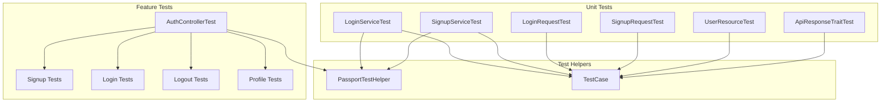
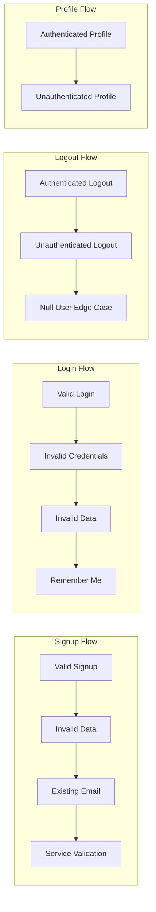
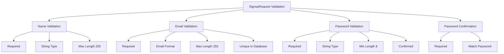

# Authentication Module Testing Documentation

## Overview

This document provides comprehensive documentation for all unit tests and feature tests implemented for the Authentication module. The testing suite ensures robust validation of authentication functionality, following Laravel testing best practices and maintaining high code coverage.

## Test Architecture



## Feature Tests

### AuthControllerTest

**File**: `tests/Feature/AuthControllerTest.php`

This test class validates the complete authentication flow through HTTP endpoints, testing the integration between controllers, services, and the database.

#### Test Coverage



#### Test Methods

##### Signup Tests

1. **`test_user_can_signup_successfully()`**
    - **Purpose**: Validates successful user registration
    - **Assertions**:
        - HTTP 201 status
        - Correct JSON structure with user and token data
        - User exists in database
    - **Test Data**: Valid user data with name, email, password, and confirmation

2. **`test_signup_fails_with_invalid_data()`**
    - **Purpose**: Ensures validation errors for invalid input
    - **Assertions**:
        - HTTP 422 status
        - Error message structure
    - **Test Data**: Empty name, invalid email, short password, mismatched confirmation

3. **`test_signup_fails_with_existing_email()`**
    - **Purpose**: Prevents duplicate email registration
    - **Assertions**:
        - HTTP 422 status
        - Validation error structure
    - **Setup**: Creates existing user first

4. **`test_signup_throws_validation_exception_for_existing_email_in_service()`**
    - **Purpose**: Tests service-layer email validation
    - **Assertions**:
        - HTTP 422 status
        - Error structure for service validation

##### Login Tests

1. **`test_user_can_login_successfully()`**
    - **Purpose**: Validates successful authentication
    - **Assertions**:
        - HTTP 200 status
        - Token and user data structure
    - **Setup**: Creates user with hashed password

2. **`test_login_fails_with_invalid_credentials()`**
    - **Purpose**: Ensures security for wrong credentials
    - **Assertions**:
        - HTTP 422 status
        - Error message structure
    - **Test Data**: Correct email, wrong password

3. **`test_login_fails_with_invalid_data()`**
    - **Purpose**: Validates input format requirements
    - **Assertions**:
        - HTTP 422 status
        - Validation error structure
    - **Test Data**: Invalid email format, empty password

4. **`test_login_with_remember_me_functionality()`**
    - **Purpose**: Tests extended token lifetime feature
    - **Assertions**:
        - HTTP 200 status
        - Token structure with extended expiration
    - **Test Data**: Valid credentials with remember_me flag

##### Logout Tests

1. **`test_authenticated_user_can_logout()`**
    - **Purpose**: Validates successful logout
    - **Assertions**:
        - HTTP 200 status
        - Success message structure
    - **Setup**: Authenticated user via Passport

2. **`test_unauthenticated_user_cannot_logout()`**
    - **Purpose**: Ensures logout requires authentication
    - **Assertions**:
        - HTTP 401 status
    - **Setup**: No authentication

3. **`test_logout_with_null_user()`**
    - **Purpose**: Edge case testing for null user scenarios
    - **Assertions**:
        - HTTP 401 status

##### Profile Tests

1. **`test_authenticated_user_can_get_profile()`**
    - **Purpose**: Validates profile data retrieval
    - **Assertions**:
        - HTTP 200 status
        - Complete user data structure
        - Correct user data matching
    - **Setup**: Authenticated user via Passport

2. **`test_unauthenticated_user_cannot_get_profile()`**
    - **Purpose**: Ensures profile access requires authentication
    - **Assertions**:
        - HTTP 401 status

#### Test Setup and Helpers

```php
protected function setUp(): void
{
    parent::setUp();
    $this->setUpPassport(); // Configures OAuth2 testing environment
}
```

**Key Features**:

- Uses `PassportTestHelper` trait for OAuth2 setup
- Uses `WithFaker` trait for realistic test data
- Includes debug output for failed responses
- Database assertions for data persistence verification

## Unit Tests

### Service Layer Tests

#### LoginServiceTest

**File**: `tests/Unit/LoginServiceTest.php`

**Purpose**: Tests the business logic of user authentication without HTTP layer dependencies.

##### Test Methods

1. **`test_service_instance_is_created_correctly()`**
    - Validates proper service instantiation
    - Ensures dependency injection works correctly

2. **`test_password_verification_works_correctly()`**
    - Tests password hashing and verification
    - Validates both correct and incorrect password scenarios

**Mocking Strategy**:

```php
$this->userRepository = Mockery::mock(UserRepository::class);
$this->loginService = new LoginService($this->userRepository);
```

#### SignupServiceTest

**File**: `tests/Unit/SignupServiceTest.php`

**Purpose**: Tests user registration business logic with comprehensive validation scenarios.

##### Test Methods

1. **`test_password_hashing_works_correctly()`**
    - Validates password hashing functionality
    - Tests hash verification for security

2. **`test_service_instance_is_created_correctly()`**
    - Ensures proper service instantiation
    - Validates dependency injection

3. **`test_password_is_hashed_correctly()`**
    - Additional password hashing validation
    - Security verification tests

4. **`test_validate_signup_data_returns_correct_rules()`**
    - Tests validation rule generation
    - Ensures correct validation structure

5. **`test_signup_throws_validation_exception_when_user_exists()`**
    - Tests email uniqueness validation
    - Validates exception handling for duplicate emails

6. **`test_signup_creates_user_and_token_successfully()`**
    - Tests complete signup flow
    - Validates user creation and token generation
    - Tests repository interaction patterns

**Advanced Mocking Example**:

```php
$this->userRepository
    ->shouldReceive('create')
    ->with(Mockery::on(function ($data) {
        return $data['name'] === 'Test User' &&
               $data['email'] === 'new@example.com' &&
               is_string($data['password']) &&
               strlen($data['password']) > 10; // Hashed password check
    }))
    ->andReturn($user);
```

### Request Validation Tests

#### LoginRequestTest

**File**: `tests/Unit/LoginRequestTest.php`

**Purpose**: Validates form request validation rules and custom messages for login functionality.

##### Test Coverage Matrix

| Test Case            | Email | Password | Expected Result |
| -------------------- | ----- | -------- | --------------- |
| Valid data           | ✓     | ✓        | Pass            |
| Missing email        | ✗     | ✓        | Fail            |
| Invalid email format | ✗     | ✓        | Fail            |
| Empty email          | ✗     | ✓        | Fail            |
| Missing password     | ✓     | ✗        | Fail            |
| Empty password       | ✓     | ✗        | Fail            |

##### Test Methods

1. **`test_authorize_returns_true()`**
    - Validates authorization logic
    - Ensures all users can attempt login

2. **`test_validation_passes_with_valid_data()`**
    - Tests successful validation scenario
    - Validates correct input acceptance

3. **Email Validation Tests**:
    - `test_validation_fails_with_missing_email()`
    - `test_validation_fails_with_invalid_email_format()`
    - `test_validation_fails_with_empty_email()`

4. **Password Validation Tests**:
    - `test_validation_fails_with_missing_password()`
    - `test_validation_fails_with_empty_password()`

5. **Custom Message Tests**:
    - `test_custom_messages_are_defined()`
    - `test_validation_with_custom_messages()`

**Custom Messages Validation**:

```php
$expectedMessages = [
    'email.required' => 'Email is required',
    'email.email' => 'Please provide a valid email address',
    'password.required' => 'Password is required'
];
```

#### SignupRequestTest

**File**: `tests/Unit/SignupRequestTest.php`

**Purpose**: Comprehensive validation testing for user registration form requests.

##### Validation Rules Coverage



##### Test Methods

1. **Authorization Test**:
    - `test_authorize_returns_true()`

2. **Name Validation Tests**:
    - `test_validation_fails_with_missing_name()`
    - `test_validation_fails_with_empty_name()`
    - `test_validation_fails_with_name_too_long()` (256+ characters)

3. **Email Validation Tests**:
    - `test_validation_fails_with_missing_email()`
    - `test_validation_fails_with_invalid_email_format()`
    - `test_validation_fails_with_duplicate_email()`

4. **Password Validation Tests**:
    - `test_validation_fails_with_missing_password()`
    - `test_validation_fails_with_short_password()` (<8 characters)
    - `test_validation_fails_with_mismatched_password_confirmation()`
    - `test_validation_fails_with_missing_password_confirmation()`

5. **Custom Message Tests**:
    - `test_custom_messages_are_defined()`
    - `test_validation_with_custom_messages()`

### Resource and Trait Tests

#### UserResourceTest

**File**: `tests/Unit/UserResourceTest.php`

**Purpose**: Tests API resource transformation logic for user data serialization.

##### Test Scenarios

1. **`test_to_array_returns_correct_structure_for_authenticated_user()`**
    - Tests resource output for authenticated users
    - Validates inclusion of sensitive fields like `email_verified`

2. **`test_to_array_returns_correct_structure_for_unauthenticated_user()`**
    - Tests resource output for unauthenticated requests
    - Validates exclusion of sensitive fields

3. **`test_to_array_returns_correct_structure_for_different_user()`**
    - Tests resource output when viewing another user's data
    - Validates privacy controls

4. **`test_to_array_handles_null_email_verified_at()`**
    - Tests edge case handling for unverified emails

#### ApiResponseTraitTest

**File**: `tests/Unit/ApiResponseTraitTest.php`

**Purpose**: Tests standardized API response formatting across the application.

##### Response Type Tests

1. **Error Response Tests**:
    - `test_not_found_response()` (404)
    - `test_unauthorized_response()` (401)
    - `test_forbidden_response()` (403)
    - `test_server_error_response()` (500)

2. **Success Response Tests**:
    - `test_no_content_response()` (204)
    - `test_paginated_response()`

**Response Structure Validation**:

```php
$data = json_decode($response->getContent(), true);
$this->assertFalse($data['success']); // For error responses
$this->assertEquals('Expected message', $data['message']);
```

## Test Execution and Coverage

### Running Tests

```bash
# Run all authentication tests
php artisan test --filter=Auth

# Run specific test classes
php artisan test tests/Feature/AuthControllerTest.php
php artisan test tests/Unit/LoginServiceTest.php
php artisan test tests/Unit/SignupServiceTest.php

# Run with coverage report
php artisan test --coverage

# Run specific test methods
php artisan test --filter=test_user_can_signup_successfully
```

### Test Coverage Matrix

| Component        | Feature Tests | Unit Tests | Coverage Areas              |
| ---------------- | ------------- | ---------- | --------------------------- |
| AuthController   | ✓             | -          | HTTP endpoints, integration |
| LoginService     | -             | ✓          | Business logic, validation  |
| SignupService    | -             | ✓          | User creation, validation   |
| LoginRequest     | -             | ✓          | Input validation, messages  |
| SignupRequest    | -             | ✓          | Input validation, messages  |
| UserResource     | -             | ✓          | Data transformation         |
| ApiResponseTrait | -             | ✓          | Response formatting         |

### Test Data Management

#### Factory Usage

```php
// Create test users with specific attributes
$user = User::factory()->create([
    'email' => 'test@example.com',
    'password' => Hash::make('password123'), // pragma: allowlist secret
    'email_verified_at' => now()
]);
```

#### Faker Integration

```php
$userData = [
    'name' => $this->faker->name,
    'email' => $this->faker->unique()->safeEmail,
    'password' => 'password123', // pragma: allowlist secret
    'password_confirmation' => 'password123', // pragma: allowlist secret
];
```

## Test Environment Setup

### PassportTestHelper

**File**: `tests/PassportTestHelper.php`

Provides OAuth2 testing utilities:

```php
trait PassportTestHelper
{
    protected function setUpPassport(): void
    {
        // Configure Passport for testing
        // Set up OAuth2 clients and keys
    }
}
```

### Database Considerations

- Tests use in-memory SQLite database for speed
- Database is refreshed between tests
- Migrations run automatically
- Factory data provides realistic test scenarios

## Security Testing

### Authentication Security

1. **Password Security**:
    - Tests verify passwords are properly hashed
    - Validates password strength requirements
    - Ensures password confirmation matching

2. **Token Security**:
    - Tests OAuth2 token generation
    - Validates token expiration handling
    - Tests token revocation on logout

3. **Input Validation**:
    - Comprehensive validation rule testing
    - SQL injection prevention through ORM
    - XSS prevention through proper escaping

### Edge Case Testing

1. **Null Value Handling**:
    - Tests for null user scenarios
    - Validates null email verification dates
    - Edge case validation for empty inputs

2. **Boundary Testing**:
    - Maximum field length validation
    - Minimum password length enforcement
    - Email format edge cases

## Best Practices Demonstrated

### Test Organization

1. **Clear Test Names**: Descriptive method names explaining test purpose
2. **Arrange-Act-Assert**: Consistent test structure
3. **Single Responsibility**: Each test validates one specific behavior
4. **Comprehensive Coverage**: Both positive and negative test cases

### Mocking Strategy

1. **Repository Mocking**: Isolates service logic from data layer
2. **Dependency Injection**: Tests service instantiation and dependencies
3. **Behavior Verification**: Validates method calls and parameters

### Data Management

1. **Factory Usage**: Consistent test data generation
2. **Database Isolation**: Tests don't interfere with each other
3. **Realistic Data**: Faker provides varied, realistic test data

## Troubleshooting Tests

### Common Issues

1. **Passport Setup Failures**:

    ```bash
    php artisan passport:keys --force
    php artisan passport:client --personal --no-interaction
    ```

2. **Database Migration Issues**:

    ```bash
    php artisan migrate:fresh --env=testing
    ```

3. **Cache Issues**:
    ```bash
    php artisan config:clear
    php artisan cache:clear
    ```

### Debug Techniques

1. **Response Debugging**:

    ```php
    if ($response->status() !== 201) {
        dump('Response status: ' . $response->status());
        dump('Response content: ' . $response->content());
    }
    ```

2. **Database State Inspection**:

    ```php
    $this->assertDatabaseHas('users', ['email' => $userData['email']]);
    ```

3. **Mock Verification**:
    ```php
    $this->userRepository->shouldHaveReceived('create')->once();
    ```

## Future Enhancements

### Potential Test Additions

1. **Performance Tests**: Response time validation
2. **Load Tests**: Concurrent authentication testing
3. **Integration Tests**: Third-party service integration
4. **Browser Tests**: End-to-end authentication flows

### Coverage Improvements

1. **Error Scenario Expansion**: More edge cases
2. **Security Testing**: Penetration testing scenarios
3. **Accessibility Testing**: API accessibility validation
4. **Documentation Testing**: API documentation accuracy

## Related Documentation

- [Authentication API Documentation](./README.md)
- [AuthController Documentation](./AuthController.md)
- [LoginService Documentation](./LoginService.md)
- [SignupService Documentation](./SignupService.md)
- [Laravel Testing Documentation](https://laravel.com/docs/testing)
- [PHPUnit Documentation](https://phpunit.de/documentation.html)
