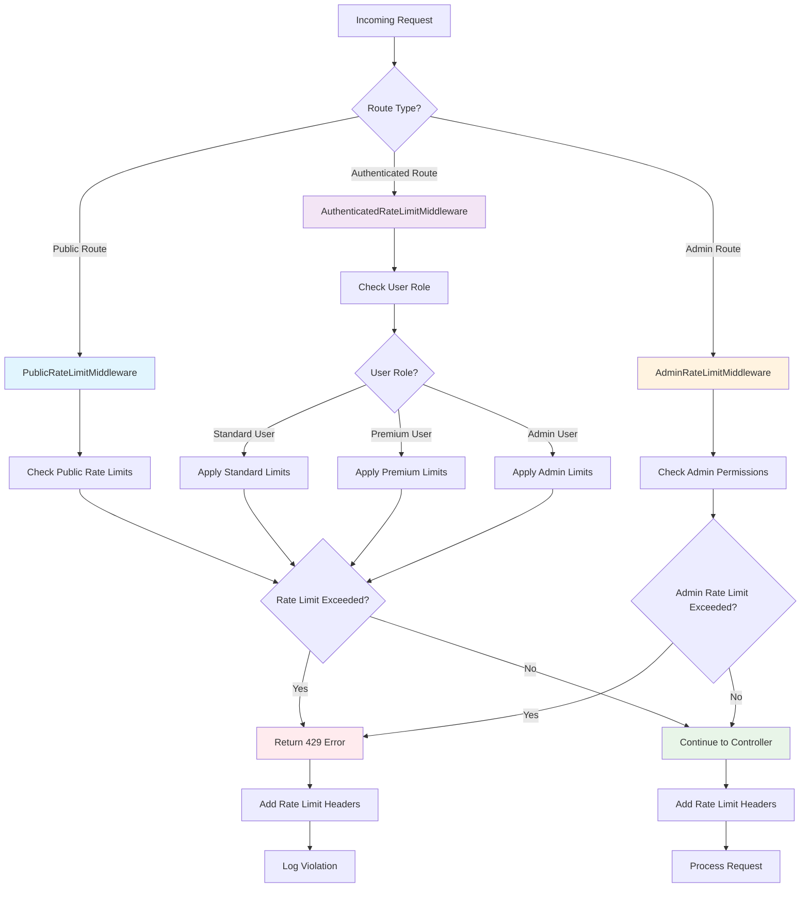
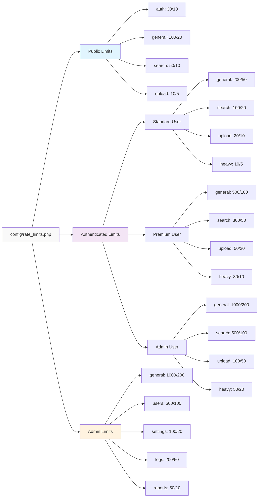

# Rate Limiting System

This Laravel API implements a comprehensive rate limiting system using custom middleware to control request frequency across different endpoint types and user roles.

## System Architecture



## Overview

The rate limiting system is designed with three main middleware components:

- **PublicRateLimitMiddleware** - For unauthenticated endpoints
- **AuthenticatedRateLimitMiddleware** - For authenticated user endpoints
- **AdminRateLimitMiddleware** - For admin-only endpoints

## Configuration

All rate limiting configurations are centralized in `config/rate_limits.php`. This file defines:

- Rate limits per request type and HTTP method
- User role-based limits (authenticated, premium, admin)
- General settings (decay minutes, logging, headers)

### Configuration Flow



_Note: Numbers shown as GET/POST limits per minute_

### Configuration Structure

```php
return [
    'public' => [
        'auth' => ['get' => 30, 'post' => 10],
        'general' => ['get' => 100, 'post' => 20],
        // ...
    ],
    'authenticated' => [
        'authenticated' => [
            'general' => ['get' => 200, 'post' => 50],
            // ...
        ],
        'premium' => [
            'general' => ['get' => 500, 'post' => 100],
            // ...
        ],
        'admin' => [
            'general' => ['get' => 1000, 'post' => 200],
            // ...
        ]
    ],
    'admin' => [
        'general' => ['get' => 1000, 'post' => 200],
        // ...
    ],
    'decay_minutes' => 1,
    'log_violations' => true,
    'add_headers' => true
];
```

## Middleware Implementation

### Public Rate Limiting

Applied to unauthenticated endpoints using `throttle.public` middleware:

- Authentication endpoints (`auth`)
- General public endpoints (`general`)
- Search endpoints (`search`)
- Upload endpoints (`upload`)

### Authenticated Rate Limiting

Applied to authenticated endpoints using `throttle.auth` middleware:

- General operations (`general`)
- Search operations (`search`)
- File uploads (`upload`)
- Heavy operations (`heavy`)

Rate limits vary based on user role:

- **Authenticated users**: Standard limits
- **Premium users**: Higher limits
- **Admin users**: Highest limits

### Admin Rate Limiting

Applied to admin-only endpoints using `throttle.admin` middleware:

- General admin operations (`general`)
- User management (`users`)
- Settings management (`settings`)
- Log access (`logs`)
- Report generation (`reports`)

## Route Configuration

Routes are organized into groups with appropriate middleware:

```php
// Public routes
Route::group(['middleware' => 'throttle.public:auth'], function () {
    Route::post('/auth/login', [AuthController::class, 'login']);
    Route::post('/auth/signup', [AuthController::class, 'signup']);
});

// Authenticated routes
Route::group(['middleware' => ['auth:api', 'throttle.auth:general']], function () {
    Route::get('/user', [AuthController::class, 'me']);
});

// Admin routes
Route::group(['middleware' => ['auth:api', 'admin', 'throttle.admin:general']], function () {
    Route::get('/admin/users', [AdminController::class, 'users']);
});
```

## Rate Limit Categories

### Public Categories

- `auth` - Authentication operations (login, signup)
- `general` - General public endpoints
- `search` - Public search functionality
- `upload` - Public file uploads

### Authenticated Categories

- `general` - Standard authenticated operations
- `search` - Authenticated search operations
- `upload` - File upload operations
- `heavy` - Resource-intensive operations

### Admin Categories

- `general` - General admin operations
- `users` - User management operations
- `settings` - System settings management
- `logs` - Log access and management
- `reports` - Report generation

## Features

### Rate Limit Headers

When enabled, the system adds standard rate limiting headers to responses:

- `X-RateLimit-Limit` - Maximum requests allowed
- `X-RateLimit-Remaining` - Remaining requests in current window
- `X-RateLimit-Reset` - Timestamp when the rate limit resets

### Violation Logging

Rate limit violations are logged when enabled, including:

- User information (if authenticated)
- Request details (IP, method, URI)
- Rate limit category and current usage
- Timestamp of violation

### User Role Detection

The system automatically detects user roles for authenticated requests:

- Checks for admin privileges
- Identifies premium users (if implemented)
- Falls back to standard authenticated user limits

## HTTP Method Support

Different rate limits can be configured for each HTTP method:

- `GET` - Typically higher limits for read operations
- `POST` - Lower limits for create operations
- `PUT`/`PATCH` - Moderate limits for update operations
- `DELETE` - Lower limits for delete operations

## Error Responses

When rate limits are exceeded, the system returns:

- **HTTP Status**: 429 Too Many Requests
- **Response Body**: JSON error message
- **Headers**: Rate limit information

```json
{
    "message": "Too Many Requests",
    "error": "Rate limit exceeded for this endpoint"
}
```

## Customization

### Adding New Categories

1. Add the category to `config/rate_limits.php`
2. Define rate limits for each HTTP method
3. Apply the middleware with the new category to routes

### Modifying Limits

Update the configuration file and clear the config cache:

```bash
php artisan config:clear
```

### Custom User Roles

Extend the middleware to support additional user roles by modifying the `getUserRole()` method in the respective middleware classes.

## Performance Considerations

- Rate limiting uses Laravel's built-in cache system
- Redis is recommended for production environments
- Consider using separate cache stores for rate limiting
- Monitor cache performance and adjust decay minutes as needed

## Security Benefits

- Prevents API abuse and DoS attacks
- Protects against brute force authentication attempts
- Ensures fair resource usage across users
- Provides different protection levels based on user privileges

## Monitoring and Analytics

The system provides logging capabilities for:

- Tracking rate limit violations
- Monitoring API usage patterns
- Identifying potential abuse
- Performance optimization insights
