# Testing Roadmap and Implementation Guide

## Overview

This document outlines the comprehensive testing strategy, implementation guidelines, and enforcement mechanisms for the Laravel API SOLID project. It serves as a roadmap for maintaining high code quality through systematic testing practices.

## Testing Philosophy

### Core Principles

1. **Test-Driven Development (TDD)**: Write tests before implementation when possible
2. **Comprehensive Coverage**: Aim for meaningful test coverage across all application layers
3. **Quality over Quantity**: Focus on valuable tests that catch real bugs
4. **Automated Enforcement**: Use CI/CD and pre-commit hooks to enforce testing standards
5. **Documentation**: Tests serve as living documentation of system behavior

### Testing Pyramid

```mermaid
graph TB
    subgraph "Testing Pyramid"
        E2E["End-to-End Tests<br/>🔍 Browser/API Integration"]
        INT["Integration Tests<br/>🔗 Component Integration"]
        UNIT["Unit Tests<br/>⚡ Individual Components"]
    end

    E2E --> INT
    INT --> UNIT

    style E2E fill:#ff9999
    style INT fill:#ffcc99
    style UNIT fill:#99ff99
```



## Current Testing Infrastructure

### Test Suites

| Test Type         | Directory             | Purpose                         | Coverage Target |
| ----------------- | --------------------- | ------------------------------- | --------------- |
| **Unit Tests**    | `tests/Unit/`         | Individual class/method testing | 80%+            |
| **Feature Tests** | `tests/Feature/`      | HTTP endpoint integration       | 90%+            |
| **Console Tests** | `tests/Unit/Console/` | Artisan command testing         | 70%+            |

### Testing Tools Stack

#### Core Testing Framework

- **PHPUnit**: Primary testing framework
- **Laravel Testing**: Built-in Laravel testing utilities
- **Mockery**: Mocking framework for dependencies
- **Faker**: Test data generation

#### Quality Assurance Tools

- **PHPStan**: Static analysis (Level 5)
- **Psalm**: Additional static analysis
- **Laravel Pint**: Code style enforcement
- **Collision**: Enhanced error reporting

#### CI/CD Integration

- **Pre-commit Hooks**: Automated quality checks
- **Docker Integration**: Consistent testing environment
- **Coverage Reporting**: HTML and XML coverage reports

## Testing Implementation Strategy

### Phase 1: Foundation (Current)

**Status**: ✅ **Completed**

**Achievements**:

- PHPUnit configuration established
- Basic test structure implemented
- Docker testing environment configured
- Pre-commit hooks for automated testing
- Authentication module fully tested (100% coverage)

**Coverage Baseline**: 2% (minimum for CI passing)

### Phase 2: Core Module Coverage (In Progress)

**Target**: 25% overall coverage

**Priority Modules**:

1. **User Management** (High Priority)
    - User CRUD operations
    - User repository patterns
    - User resource transformations

2. **API Response System** (High Priority)
    - Response trait testing
    - Error handling validation
    - Status code verification

3. **Service Layer** (Medium Priority)
    - Business logic validation
    - Service dependency injection
    - Service method contracts

**Implementation Timeline**: 4-6 weeks

### Phase 3: Comprehensive Coverage (Planned)

**Target**: 60% overall coverage

**Focus Areas**:

1. **Database Layer**
    - Repository pattern testing
    - Model relationship validation
    - Query optimization testing

2. **Middleware Testing**
    - Authentication middleware
    - Rate limiting validation
    - CORS policy testing

3. **Configuration Testing**
    - Environment configuration
    - Service provider testing
    - Route registration validation

**Implementation Timeline**: 8-10 weeks

### Phase 4: Advanced Testing (Future)

**Target**: 80%+ overall coverage

**Advanced Features**:

1. **Performance Testing**
    - Load testing for critical endpoints
    - Database query performance
    - Memory usage optimization

2. **Security Testing**
    - Penetration testing scenarios
    - Input validation edge cases
    - Authentication bypass attempts

3. **Browser Testing**
    - End-to-end user workflows
    - JavaScript integration testing
    - Cross-browser compatibility

**Implementation Timeline**: 12-16 weeks

## Testing Standards and Guidelines

### Test Organization

#### File Structure

```
tests/
├── Feature/
│   ├── Auth/
│   │   └── AuthControllerTest.php
│   ├── User/
│   │   └── UserControllerTest.php
│   └── Api/
│       └── ApiEndpointTest.php
├── Unit/
│   ├── Services/
│   │   ├── Auth/
│   │   └── User/
│   ├── Repositories/
│   ├── Models/
│   └── Console/
└── Helpers/
    ├── PassportTestHelper.php
    └── DatabaseTestHelper.php
```

#### Naming Conventions

**Test Classes**:

- Feature Tests: `{Controller}Test.php`
- Unit Tests: `{Class}Test.php`
- Console Tests: `{Command}Test.php`

**Test Methods**:

- Descriptive names: `test_user_can_login_with_valid_credentials()`
- Behavior-focused: `test_returns_404_when_user_not_found()`
- Edge cases: `test_handles_null_email_gracefully()`

### Test Quality Standards

#### Test Structure (AAA Pattern)

```php
public function test_user_can_create_post()
{
    // Arrange
    $user = User::factory()->create();
    $postData = ['title' => 'Test Post', 'content' => 'Test Content'];

    // Act
    $response = $this->actingAs($user)->postJson('/api/posts', $postData);

    // Assert
    $response->assertStatus(201);
    $this->assertDatabaseHas('posts', $postData);
}
```

#### Coverage Requirements

**Minimum Coverage by Component**:

- Controllers: 90% (critical user-facing functionality)
- Services: 85% (business logic validation)
- Repositories: 80% (data access patterns)
- Models: 70% (relationships and scopes)
- Middleware: 95% (security-critical components)

#### Test Data Management

**Factories Usage**:

```php
// Preferred: Use factories for consistent test data
$user = User::factory()->verified()->create();

// Acceptable: Custom data when testing specific scenarios
$user = User::factory()->create(['email' => 'specific@test.com']);
```

**Database Isolation**:

- Use `RefreshDatabase` trait for feature tests
- Use transactions for unit tests when possible
- Clean up test data in `tearDown()` methods

## Enforcement Mechanisms

### Automated Quality Gates

#### Pre-commit Hooks

**Configured Hooks** (`.pre-commit-config.yaml`):

1. **Laravel Pint**: Code style enforcement
2. **PHPStan**: Static analysis (Level 5)
3. **PHPUnit**: Test execution
4. **Composer Audit**: Security vulnerability scanning

**Hook Execution**:

```bash
# Automatic execution on commit
git commit -m "Feature implementation"

# Manual execution
pre-commit run --all-files

# Skip hooks (emergency only)
git commit --no-verify -m "Emergency fix"
```

#### Continuous Integration

**CI Pipeline Stages**:

1. **Environment Setup**: Docker container initialization
2. **Dependency Installation**: Composer and NPM packages
3. **Code Quality**: PHPStan, Psalm, and Pint execution
4. **Test Execution**: PHPUnit with coverage reporting
5. **Security Audit**: Vulnerability scanning
6. **Deployment**: Automated deployment on success

### Coverage Enforcement

#### Current Configuration

```xml
<!-- phpunit.xml -->
<coverage>
    <report>
        <html outputDirectory="coverage-html"/>
        <text outputFile="coverage.txt"/>
        <clover outputFile="coverage.xml"/>
    </report>
</coverage>
```

#### Coverage Progression

**Milestone Targets**:

- **Phase 1**: 2% (Current baseline)
- **Phase 2**: 25% (Core modules)
- **Phase 3**: 60% (Comprehensive)
- **Phase 4**: 80% (Production-ready)

**Enforcement Strategy**:

- Gradual increase in minimum coverage requirements
- Module-specific coverage targets
- Coverage reports in CI/CD pipeline
- Team review for coverage decreases

## Testing Commands and Workflows

### Development Workflow

#### Daily Development

```bash
# Start development environment
make dev

# Run tests during development
make test

# Run tests with coverage
make test-coverage

# Run specific test suite
php artisan test tests/Feature/AuthControllerTest.php

# Run specific test method
php artisan test --filter=test_user_can_login
```

#### Code Quality Checks

```bash
# Full quality analysis
make full-quality-check

# Individual quality checks
make phpstan          # Static analysis
make code-style       # Code formatting
make security-audit   # Security scanning
```

#### Pre-commit Workflow

```bash
# Setup pre-commit hooks (one-time)
make setup-pre-commit

# Test pre-commit configuration
make test-pre-commit

# Update hooks to latest versions
make update-pre-commit
```

### Testing Best Practices

#### Test Writing Guidelines

1. **Test Behavior, Not Implementation**

    ```php
    // Good: Tests behavior
    public function test_user_receives_welcome_email_after_registration()

    // Bad: Tests implementation
    public function test_signup_service_calls_mail_facade()
    ```

2. **Use Descriptive Test Names**

    ```php
    // Good: Clear intent
    public function test_returns_validation_error_when_email_is_missing()

    // Bad: Unclear purpose
    public function test_validation()
    ```

3. **Test Edge Cases**

    ```php
    public function test_handles_extremely_long_input_gracefully()
    public function test_processes_empty_arrays_correctly()
    public function test_manages_null_values_safely()
    ```

4. **Mock External Dependencies**

    ```php
    public function test_user_creation_with_mocked_email_service()
    {
        Mail::fake();

        $user = $this->userService->create($userData);

        Mail::assertSent(WelcomeEmail::class);
    }
    ```

#### Performance Considerations

**Test Optimization**:

- Use in-memory SQLite for faster test execution
- Minimize database operations in unit tests
- Use factories instead of manual data creation
- Group related tests in single test classes

**Parallel Execution**:

```bash
# Run tests in parallel (when available)
php artisan test --parallel

# Specify number of processes
php artisan test --parallel --processes=4
```

## Security Testing

### Authentication Security

**Test Coverage Areas**:

1. **Password Security**
    - Password hashing validation
    - Password strength requirements
    - Password reset token security

2. **Token Management**
    - OAuth2 token generation
    - Token expiration handling
    - Token revocation on logout

3. **Input Validation**
    - SQL injection prevention
    - XSS attack prevention
    - CSRF protection validation

### API Security Testing

**Security Test Examples**:

```php
public function test_api_requires_authentication()
{
    $response = $this->getJson('/api/users');
    $response->assertStatus(401);
}

public function test_prevents_sql_injection_in_search()
{
    $maliciousInput = "'; DROP TABLE users; --";
    $response = $this->getJson("/api/users?search={$maliciousInput}");
    $response->assertStatus(200); // Should handle gracefully
}
```

## Monitoring and Metrics

### Coverage Tracking

**Key Metrics**:

- Overall code coverage percentage
- Coverage by module/component
- Test execution time trends
- Test failure rates

**Reporting Tools**:

- HTML coverage reports (`coverage-html/`)
- XML coverage for CI integration
- Text-based coverage summaries

### Quality Metrics

**Code Quality Indicators**:

- PHPStan error count and levels
- Code style violations
- Security vulnerability count
- Test execution performance

## Troubleshooting

### Common Testing Issues

#### Database Issues

```bash
# Reset test database
php artisan migrate:fresh --env=testing

# Clear application cache
php artisan config:clear
php artisan cache:clear
```

#### Passport Authentication Issues

```bash
# Regenerate Passport keys
php artisan passport:keys --force

# Create personal access client
php artisan passport:client --personal --no-interaction
```

#### Docker Environment Issues

```bash
# Restart development environment
make down
make dev

# Rebuild containers
make dev-build
```

### Performance Issues

**Slow Test Execution**:

1. Check database configuration (use SQLite in memory)
2. Minimize external API calls in tests
3. Use database transactions instead of migrations
4. Optimize factory usage

**Memory Issues**:

1. Increase PHPUnit memory limit
2. Use `--stop-on-failure` for debugging
3. Run tests in smaller batches
4. Clear caches between test runs

## Future Enhancements

### Planned Improvements

#### Short-term (Next 3 months)

1. **Enhanced Coverage Reporting**
    - Module-specific coverage dashboards
    - Coverage trend analysis
    - Integration with development workflow

2. **Advanced Testing Tools**
    - Mutation testing with Infection
    - Performance regression testing
    - API contract testing

#### Medium-term (3-6 months)

1. **Browser Testing Integration**
    - Laravel Dusk implementation
    - Cross-browser testing setup
    - Visual regression testing

2. **Load Testing Framework**
    - API endpoint load testing
    - Database performance testing
    - Scalability validation

#### Long-term (6+ months)

1. **AI-Assisted Testing**
    - Automated test generation
    - Intelligent test case suggestions
    - Predictive failure analysis

2. **Advanced Security Testing**
    - Automated penetration testing
    - Dependency vulnerability scanning
    - Runtime security monitoring

## Contributing to Testing

### For Developers

**When Adding New Features**:

1. Write tests before implementation (TDD)
2. Ensure minimum coverage requirements
3. Include both positive and negative test cases
4. Update documentation for complex test scenarios

**When Fixing Bugs**:

1. Write a failing test that reproduces the bug
2. Fix the implementation
3. Verify the test passes
4. Add regression tests for edge cases

### Code Review Guidelines

**Test Review Checklist**:

- [ ] Tests cover the main functionality
- [ ] Edge cases are tested
- [ ] Test names are descriptive
- [ ] No hardcoded values in tests
- [ ] Proper use of factories and mocking
- [ ] Tests are independent and isolated

## Related Documentation

### Project Documentation

- [Authentication Testing Guide](../Auth/Testing.md)
- [Code Quality Tools](./code-quality-tools.md)
- [Pre-commit Setup](./pre-commit-setup.md)
- [Architecture Guide](./architecture.md)
- [DevOps Guide](./devops.md)

### External Resources

- [Laravel Testing Documentation](https://laravel.com/docs/testing)
- [PHPUnit Documentation](https://phpunit.de/documentation.html)
- [Mockery Documentation](http://docs.mockery.io/)
- [Laravel Dusk Documentation](https://laravel.com/docs/dusk)

---

**Last Updated**: December 2024  
**Version**: 1.0  
**Maintainer**: Development Team

> This roadmap is a living document that evolves with the project. Regular updates ensure it remains relevant and actionable for the development team.
